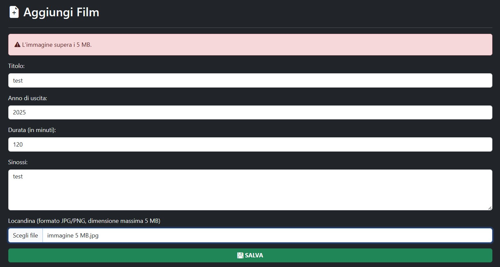

# Cinema Web App

 

Progetto Spring API di Sicurezza nelle Architetture Orientate ai Servizi (a.a. 2024-2025)

---

## Descrizione

Cinema Web App è un microservizio sviluppato con il framework Spring Boot. 

Il microservizio gestisce una web app per un cinema, con la quale gli utenti possono vedere i film in programmazione e acquistare (in modo fittizio) i biglietti per gli spettacoli. Gli amministratori, invece, possono gestire i film e la programmazione degli spettacoli mediante una dashboard dedicata. La web app integra l'autenticazione anche mediante OAuth 2.0 (provider Amazon) e l'accesso basato sui ruoli RBAC (ruoli 'USER' e 'ADMIN').

Il microservizio si occupa anche di fornire degli endpoint API REST, con i quali gli utenti possono autenticarsi e ottenere un token JWT, consultare la lista dei film, degli spettacoli, acquistare i biglietti e vederne lo storico.

---

## Dipendenze (Maven)

- **Spring Web**
- **Spring Data JPA**
- **Spring OAuth 2.0 Client**
- **Spring Security**
- **Thymeleaf**
- **Database MySQL**
- **JSON Web Token (0.11.5)**
- **Apache Tika (3.2.0)**
- **Bucket4j (8.2.0)**

---

## Installazione e configurazione

1. In Eclipse IDE, installare il plugin Spring Tools (se già installato passare direttamente al punto 2):
   - Dalla barra in alto, selezionare **"Help"** > **"Eclipse Marketplace"**
   - Nella tab **"Search"** inserire nella barra di ricerca **"Spring Tools"** e cliccare su **"Install"**
2. Clonare il repository ed importarlo in Eclipse IDE:
   - In Eclipse IDE, dalla barra in alto selezionare **"File"** > **"Import..."** > **"General"** > **"Project from Folder or Archive"** 
   - Selezionare la directory del repository clonato e fare clic su **"Finish"**
3. Creare database e db user eseguendo il file **createdb.sql** tramite **MySQL Command Line Client**:
   - Aprire il file **createdb.sql** con un editor di testo e impostare una password al posto di **'[YOUR_PASSWORD]'**. Salvare il file.
   - Aprire **MySQL Command Line Client** e importare il file **createdb.sql** con l'istruzione:
```bash
source C:\[TUO_PERCORSO]\createdb.sql
```
4. Tramite bash o command prompt, creare un keystore PCKS12 con un certificato autofirmato mediante il tool **"keytool"** di Java (essenziale per funzionamento HTTPS).
5. Impostare le variabili d'ambiente del progetto:
   - In Eclipse IDE, fare clic con il tasto destro sulla cartella del progetto **"cinema-webapp"** dal pannello **"Package Explorer"**
   - Dal menù a tendina selezionare **"Run As"** > **"Run Configurations..."**
   - Cliccare **"Spring Boot App"**, creare un nuovo profilo e selezionare il progetto (cinema-webapp) e la main class (**"CinemaWebappApplication.java"**, package **"com.cinema"**)
   - Dalla tab **"Environment"** cliccare su **"Add"** e creare le variabili contenute nel file **"application.properties"** (come '${DB_NAME}'), presente nella directory **"src/main/resources"** del progetto.
6. In Eclipse IDE, avviare il microservizio cliccando sulla tab in basso **"Boot Dashboard"**, poi fare clic con il tasto destro su *"cinema-webapp"* e selezionare **"(Re)start"**. 

---

## Panoramica della web app

La web app è costituita dalle seguenti pagine:

1. **Homepage** (localhost:8443/home)
   - Pagina iniziale che mostra i film in programmazione


2. **Login** (localhost:8443/login)
   - Form di login con combinazione email/password (utenti e admin) o OAuth 2.0 Amazon (solo utenti)


3. **Registrazione** (localhost:8443/register)
   - Form di registrazione nuovo utente con check su robustezza password


4. **Acquisto biglietti** (localhost:8443/purchase)
   - Pagina di acquisto biglietti per uno spettacolo di un determinato film (funzionalità disponibile previa autenticazione)


5. **Pagina amministratore** (localhost:8443/admin)
   - Dashboard per amministratore (gestione film e gestione spettacoli)


---

## HTTPS su Spring

La web app è configurata per accettare solo richieste HTTPS (su porta 8443), in modo da poter cifrare e rendere sicuro il traffico dopo handshake TLS tra il server e il browser dell'utente.

Per raggiungere la web app, è necessario quindi usare un URL **"https"** (quindi non il semplice 'http'). Ad esempio: 
```bash
https://localhost:8443/home
```

In caso di avviso di sicurezza da parte del browser (causato dal certificato autofirmato), è necessario aggirare la protezione cliccando su un pulsante del tipo **"Accetta i rischi e prosegui comunque"** (può variare a seconda del browser utilizzato).

---

## OAuth 2.0 Amazon (Login with Amazon)

Per l'autenticazione OAuth 2.0 è stato utilizzato il servizio **Login with Amazon**, di Amazon Developer.
  
Dopo aver creato un profilo sviluppatore, dalla **Developer Console** è stata registrata un'applicazione con il nome `cinema-webapp`, abilitando il profilo OAuth 2.0 e configurando gli URI di reindirizzamento necessari.  
Durante questa fase sono stati generati il **Client ID** e il **Client Secret**, utilizzati per integrare il flusso OAuth 2.0 nella web app.  
L'applicazione richiede l'accesso ai dati di base dell'utente (email).


---

## RBAC e configurazione Spring Security

La web app offre diverse funzionalità, a seconda del ruolo dell'utente autenticato:

| Ruolo | Descrizione | Route consentite (Security) |
|---------|---------|---------|
| **USER** | L'utente può autenticarsi, consultare la programmazione e prenotare biglietti | /home, /login, /register, /purchase**, /my-tickets |
| **ADMIN** | L'admin, oltre ai normali privilegi, può gestire i film e la programmazione degli spettacoli | Le stesse di USER + /admin**|

---

## API REST

Il microservizio offre i seguenti endpoint REST:

| Endpoint | Richiede autorizzazione | Descrizione |
|---------|---------|---------|
| `POST /api/login` | NO | Autenticazione ed emissione token JWT |
| `GET /api/films` | NO | Elenca i film in programmazione |
| `GET /api/showtimes` | NO | Elenca gli spettacoli in programma |
| `POST /api/purchase` | SI | Acquista biglietto per spettacolo e quantità indicata |
| `GET /api/my-tickets` | SI | Restituisce lo storico dei biglietti acquistati da un utente |

### Funzionamento degli endpoint

#### `POST /api/login`

Autentica l’utente e restituisce un token JWT da inserire nell'Authorization per le richieste da inviare agli endpoint protetti.

**Richiesta:**

```json
{
  "email": "utente@utente.com",
  "password": "password"
}
```

**Risposta:**

```json
{
  "token": "eyJhbGciOiJIUzUxMiJ9..."
}
```

#### `GET /api/films`

Restituisce l’elenco dei film attualmente in programmazione. Endpoint pubblico.

**Richiesta:**

```bash
GET /api/films
```

**Risposta:**

```json
{
        "filmId": 1,
        "title": "Avengers: Endgame",
        "year": 2019,
        "duration": 181,
        "description": "Alla deriva nello spazio senza cibo o acqua, Tony Stark ...",
        "showtimes": [
            "2025-06-28T20:00:00",
            "2025-06-24T18:30:00"
        ]
}...
```

#### `GET /api/showtimes`

Restituisce la lista degli spettacoli in programma. Endpoint pubblico.

**Richiesta:**

```bash
GET /api/showtimes
```

**Risposta:**

```json
{
        "id": 1,
        "filmId": 1,
        "filmTitle": "Avengers: Endgame",
        "showtime": "2025-06-28T20:00:00"
}...
```

#### `POST /api/purchase`

Permette a un utente autenticato di acquistare uno o più biglietti per uno spettacolo specifico. **Richiede autenticazione** (JWT nel header **Authorization**).

**Richiesta:**

```json
{
  "showtimeId": 3,
  "quantity": 1
}
```

**Risposta:**

```bash
'Biglietto acquistato con successo!'
```

#### `GET /api/my-tickets`

Restituisce lo storico dei biglietti acquistati dall’utente . **Richiede autenticazione** (JWT nel header **Authorization**).

**Richiesta:**

```bash
GET /api/my-tickets
```

**Risposta:**

```json
{
        "ticketId": 1,
        "showtimeId": 1,
        "filmTitle": "Avengers: Endgame",
        "showtime": "2025-06-28T20:00:00",
        "quantity": 1
}...
```

---

## Rate Limiting su endpoint REST (Bucket4j)

Per mitigare possibili attacchi sugli endpoint REST (flooding, DDoS ecc.), il microservizio sfrutta la libreria Bucket4j per impostare un numero di richieste massimo a seconda dell'indirizzo IP dell'utente.

Di default e per scopi progettuali, l'attuale limite di richieste API è impostato a 10 al minuto per indirizzo IP.  

---

## Test di sicurezza

Di seguito sono riportati i test di sicurezza effettuati sulla web app e sugli endpoint REST:

### TEST 1: Registrazione

- Formato email non valido 


- Password non sufficientemente sicura


- Campi 'Password' e 'Conferma Password' non corrispondenti


 
### TEST 2: Login

- Credenziali non valide


- Accesso con email OAuth (utente registrato senza password nel database) 

Il login fallisce e viene mostrato l'errore "Credenziali non valide".

### TEST 3: Acquisto biglietti

- Tentativo di acquisto senza autenticazione


### TEST 4: Aggiunta nuovo film 

- Apache Tika: formato immagine locandina errato (no JPEG/PNG)


- Apache Tika: immagine locandina troppo grande (maggiore di 5 MB)




- Testo HTML nel campo 'descrizione' (attacco stored XSS)


### TEST 5: endpoint 'POST /api/login'

- Tentativo di richiesta token JWT con email/password non valide

**Risposta:**
```bash
Credenziali non valide.
```
- Tentativo di login con profilo OAuth (senza password)

**Richiesta:**
```json
{
  "email": "utente@oauth.it",
  "password": ""
}
```

**Risposta:**
```bash
Credenziali non valide.
```

### TEST 6: endpoint 'POST /api/purchase'

- Tentativo di acquisto senza token JWT nell'Authorization

**Risposta:**
```bash
Errore del server.
```

- Tentativo di acquisto per spettacolo già passato

**Risposta:**
```bash
Attenzione! Lo spettacolo è già passato.
```

- Tentativo di acquisto per spettacolo non esistente

**Richiesta:**
```json
{
  "showtimeId": [ID_NON_ESISTENTE]
  "quantity": 1
}
```

**Risposta:**
```bash
Spettacolo non trovato.
```

- Tentativo di acquisto con quantità di biglietti minore o uguale a 0  

**Richiesta:**
```json
{
  "showtimeId": 1
  "quantity": 0
}
```

**Risposta:**
```bash
Quantità non valida.
```

### TEST 7: endpoint 'GET /api/my-tickets'

- Tentativo di richiesta senza token JWT nell'Authorization

**Risposta:**
```bash
Errore del server.
```
